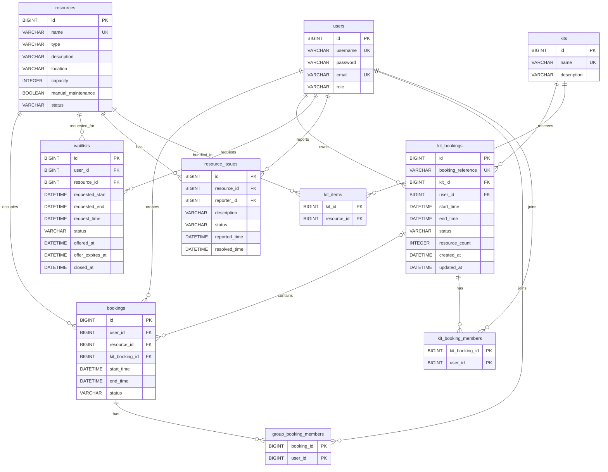

# Current ER diagram

This Mermaid ER diagram is the maintainable source for the current persistent model. It is derived from `src/main/resources/schema.sql` and cross-checked against the JPA entities in `src/main/java/com/campusbooking/model`. Association tables are shown explicitly so the foreign keys and composite keys remain clear.

## Relationship notes

- `bookings` is the resource-occupancy table. A nullable `kit_booking_id` identifies child holds belonging to a parent `kit_bookings` row.
- `group_booking_members` links additional users to a standard booking; `kit_booking_members` provides the equivalent parent-level relationship for a Project Kit reservation.
- `kit_items` defines the resources included in a Kit.
- `waitlists` stores the exact resource and requested interval plus the offer lifecycle timestamps.
- `resource_issues` links a Student reporter to a resource and stores the issue/maintenance lifecycle.

The old root diagram was created before the final Kit, issue, availability, and exact-slot Waitlist model. It is retained only for historical reference as `docs/ER-Diagram-Historical.png`; this file is the authoritative editable diagram source for the current repository.
